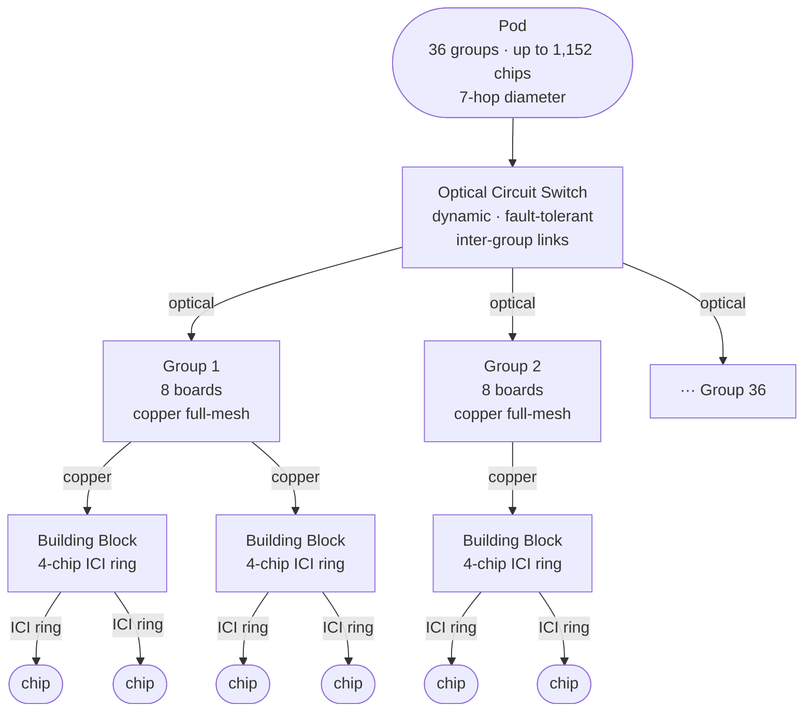

# Boardfly — TPU v8i Interconnect Topology

← [TPU v8](tpu_v8.md) | [TPU Index](index.md)

Boardfly is the custom network topology designed for Google's TPU v8i inference chip, introduced in April 2025. It replaces the torus topology used in training-oriented TPUs with a **hierarchical, high-radix structure** inspired by Dragonfly networks. The core design goal is minimizing all-to-all communication latency for inference workloads — particularly Mixture-of-Experts (MoE) models and agentic AI systems — rather than maximizing total chip count as training pods do.

---

## Topology Overview

Boardfly organizes chips in three nested levels:

```
Pod (up to 36 groups, 1,152 chips total)
 └── Group (8 boards, fully connected via copper)
      └── Building Block / Tray (4-chip ring, internal ICI links)
```



### Level 1 — Building Block (Tray)

- 4 chips connected in a **ring** using internal ICI links
- Each chip has **16 external ICI ports** available for upper-level connectivity
- The ring handles intra-tray traffic with minimum latency

### Level 2 — Group

- **8 boards** (trays) fully connected via **copper cabling**
- Each board uses **11 of its 16 external ports** for intra-group links
- Result: a dense, fully-connected 8-node cluster with high bisection bandwidth
- Remaining 5 external ports per board are available for pod-level optical links

### Level 3 — Pod

- Up to **36 groups** interconnected via **Optical Circuit Switches (OCS)**
- Maximum pod size: **1,152 chips** (1,024 active)
- OCS provides dynamic reconfiguration and automatic fault bypass with no human intervention

---

## Network Diameter

The key performance claim for Boardfly is a **~56% reduction in network diameter** compared to a 3D torus at equivalent scale:

| Topology | Pod size | Max hops (diameter) |
|----------|----------|----------------------|
| 3D Torus (8×8×16) | 1,024 chips | 16 hops |
| Boardfly | 1,024 chips | 7 hops |

Fewer hops directly reduce worst-case all-to-all latency. For autoregressive decode and expert routing in MoE models, where every generated token triggers collective communication across chips, this translates to measurable end-to-end latency improvement.

### Path comparison — 3D Torus vs Boardfly

```mermaid
flowchart TB

  subgraph TORUS["3D Torus  (8 × 8 × 16  ·  1,024 chips)  —  worst-case: 16 hops"]
    direction LR
    TA(["Chip A"])
    TB(["Chip B"])
    TA -->|1| t1((·)) -->|2| t2((·)) -->|3| t3((·)) -->|4| t4((·)) -->|5| t5((·)) -->|6| t6((·)) -->|7| t7((·)) -->|8| t8((·)) -->|9| t9((·)) -->|10| t10((·)) -->|11| t11((·)) -->|12| t12((·)) -->|13| t13((·)) -->|14| t14((·)) -->|15| t15((·)) -->|16| TB
  end

  subgraph BF["Boardfly  (1,024 chips)  —  worst-case: 7 hops"]
    direction LR

    subgraph BBA["Building Block A  (ICI ring)"]
      direction LR
      CA(["Chip A"]) -->|"① ICI"| ba1((·)) -->|"② ICI"| ba2((·))
    end

    subgraph GA["Group A  (copper full-mesh)"]
      ba2 -->|"③ copper"| ga1((·))
    end

    ga1 -->|"④ OCS"| gb1((·))

    subgraph GB["Group B  (copper full-mesh)"]
      gb1 -->|"⑤ copper"| bb1((·))
    end

    subgraph BBB["Building Block B  (ICI ring)"]
      direction LR
      bb1 -->|"⑥ ICI"| bb2((·)) -->|"⑦ ICI"| CB(["Chip B"])
    end

  end
```



Each hop in the Boardfly path maps to a physical link type and a hierarchy level crossing: two ICI hops traverse the source building block ring, one copper hop exits to the group mesh, one OCS hop crosses to the destination group, one copper hop enters the destination building block, and two ICI hops reach the target chip.

---

## Bandwidth Specifications

| Link type | Bandwidth |
|-----------|-----------|
| ICI (chip-to-chip) | 19.2 Tbps per chip |
| Scale-out (DCN) | 400 Gbps per chip (4× vs prior gen) |
| HBM (on-chip memory) | 8.6 TB/s per chip |

---

## Collectives Acceleration Engine (CAE)

Boardfly's topology benefits are amplified by the on-chip **CAE**, a dedicated hardware unit for collective communication operations:

- Handles **all-reduce**, **all-gather**, and synchronization steps on-chip
- Aggregates results across tensor cores with near-zero software overhead
- Reduces on-chip collective latency by **up to 5×** vs prior generation
- Replaces the 4 SparseCore units from v7; each v8i chip has 2 Tensor Cores + 1 CAE

Without CAE, the network diameter savings of Boardfly would be partially offset by software-overhead collective operations. The two features are designed as a system.

---

## Why Not Torus for Inference?

| Property | 3D Torus (v8t / training) | Boardfly (v8i / inference) |
|----------|--------------------------|---------------------------|
| Scale | 9,600 chips per superpod | 1,152 chips per pod |
| Network diameter | High (scales with chip count) | Fixed 7 hops |
| All-reduce pattern | Bulk synchronous (gradient sync) | Sparse, irregular (MoE routing) |
| Latency sensitivity | Throughput-optimized | Latency-optimized |
| Fault tolerance | Static topology | OCS dynamic reconfiguration |

Training workloads execute long, regular all-reduce passes over all gradients — the torus amortizes latency well across large batches. Inference for agentic and MoE workloads is instead dominated by many short, irregular collective operations (expert dispatch, KV cache sharing across context). Boardfly is shaped around these patterns.

---

## Relationship to Dragonfly Topology

Boardfly draws from the academic **Dragonfly topology** (Kim et al., 2008 / Dally & Towles; Google Research variant 2010), which achieves high radix by:
1. Grouping routers into fully-connected local clusters
2. Connecting clusters with fewer long-range links (optical in Google's case)

Boardfly adapts this to TPU hardware by:
- Using chip ICI rings as the local layer (not router chips)
- Copper cables for intra-group full-mesh (board → board)
- OCS for inter-group links (reconfigurable, fault-tolerant)

The result is a hardware-native Dragonfly variant without dedicated switching silicon.

---

## Practical Implications for Performance Modeling

When modeling inference latency on a TPU v8i pod:

1. **All-to-all latency** should use **7-hop diameter**, not the chip count-derived torus formula
2. **ICI bandwidth** is 19.2 Tbps per chip; group-level and pod-level effective BW depends on the collective pattern
3. **CAE offload** means collective operation time is nearly constant and small — model it as a fixed per-step overhead rather than scaling with message size below CAE capacity
4. **Scale-out (DCN)** at 400 Gbps per chip is the bottleneck for multi-pod serving (e.g., tensor-parallel across pods)

---

## References

- Google Cloud — "TPU 8t and TPU 8i Technical Deep Dive" (April 2025): https://cloud.google.com/blog/products/compute/tpu-8t-and-tpu-8i-technical-deep-dive
- Google Blog — "Eighth Generation TPUs: Two Chips for the Agentic Era" (April 2025): https://blog.google/innovation-and-ai/infrastructure-and-cloud/google-cloud/eighth-generation-tpu-agentic-era/
- Kim et al. (2008). "Technology-Driven, Highly-Scalable Dragonfly Topology." *ISCA 2008*. (foundational Dragonfly paper)
- Google Research variant: https://research.google.com/pubs/archive/34926.pdf

---

## See Also

- [TPU v8t / v8i specs](tpu_v8.md)
- [TPU family overview](index.md)
- [Roofline params](../roofline_params.md)
