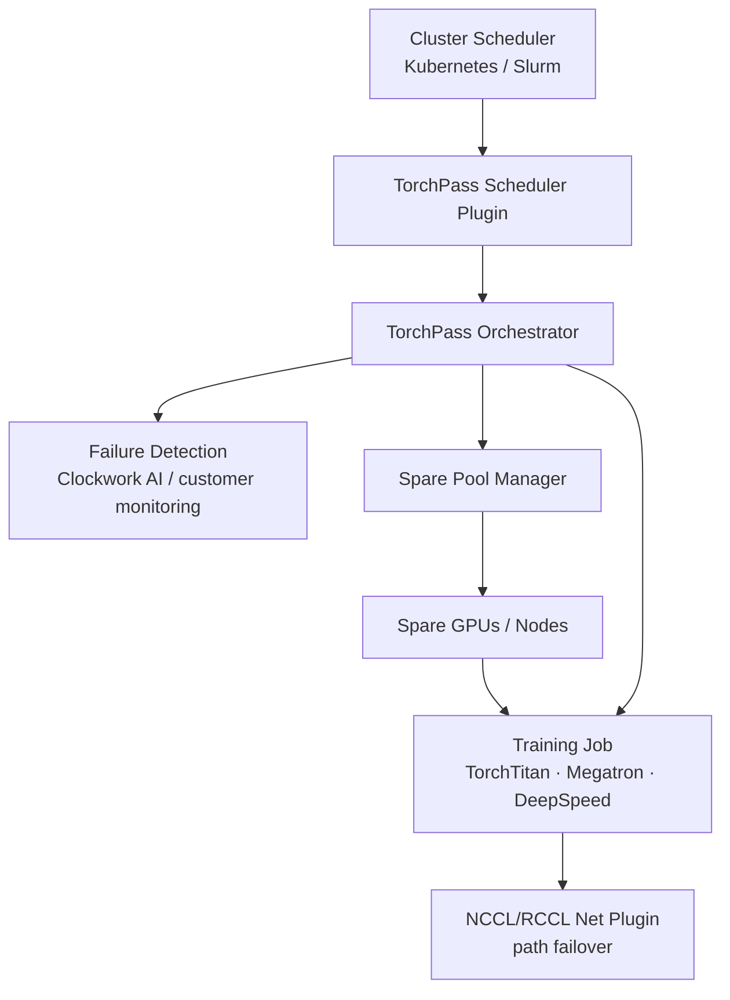
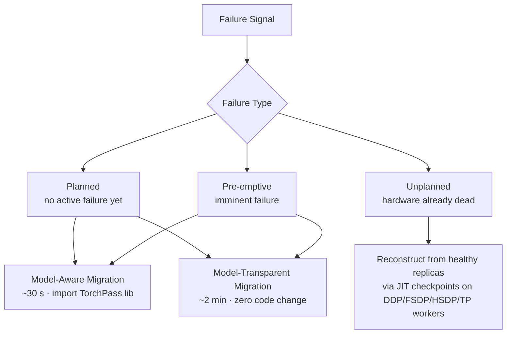

# Training Fault Tolerance

← [Simulation Index](index.md)

Fault tolerance is the gap between *theoretical MFU* and *effective MFU* in production clusters. As GPU count scales, failure rates rise and the cost of each interruption compounds — making fault handling a first-class performance concern, not just an operational one.

---

## Cluster Failure Rates

MTTF shrinks rapidly with cluster size because any single component failure can terminate the entire job:

| Cluster Size | MTTF |
|---|---|
| 1,024 GPUs | 7.9 hours |
| 16,384 GPUs | 1.8 hours |

Source: Clockwork production data — 419 failures documented over 54 days. Additionally ~60% of jobs experience slowness from soft failures (link flaps, stragglers) that degrade throughput without triggering a full restart.

---

## Cost of Checkpoint-Restart Recovery

The standard recovery path chains four sequential delays:

```
[failure]
    │
    ├─ lost compute work ──────── avg 1.5 h re-run (since last checkpoint)
    ├─ node replacement ────────── ~10 min  (provision, patch, firmware)
    ├─ checkpoint restore ──────── ~5 min   (load from persistent storage)
    └─ job startup ─────────────── ~5 min   (init, collective setup)
                                            ─────────────────────────────
[resume]                             total ~2 h per incident
```

Monthly cost model for a 1,024-GPU cluster:

```
Cost_per_incident = (avg_lost_work + t_replace + t_restore + t_startup) × cluster_cost_rate
Monthly cost ≈ $307,000   (incidents every ~7.9 h, A100/H100 spot rates)
```

---

## Effective vs. Theoretical MFU

Checkpoint-restart erodes sustained throughput even without counting monetary cost:

```
Effective_MFU = Theoretical_MFU × MTTF / (MTTF + avg_recovery)
```

| Scenario | Effective MFU multiplier |
|---|---|
| Checkpoint-restart (MTTF=7.9 h, recovery=2 h) | × 0.80 |
| TorchPass model-transparent (~10 min/day lost) | × 0.99 |

Clockwork claims model-transparent migration reduces daily wasted training time from ~3 hours to under 10 minutes on a 1,024-GPU cluster — a ~95% reduction.

---

## Fault Tolerance Approaches Compared

| Approach | Recovery granularity | Progress lost | Normal-operation overhead | Notes |
|---|---|---|---|---|
| **Checkpoint-restart** | Full job restart | Since last checkpoint (avg 1.5 h) | Checkpoint I/O | Universal; no framework dependency |
| **TorchFT** (Meta, 2024) | Per training step | Current step only | Per-iteration Gloo overhead | Requires DDP; shrinks effective batch on failure |
| **TorchPass** (Clockwork) | Live migration | Near-zero (planned/pre-emptive) | Minimal sidecar | Software-only; supports DDP/FSDP/HSDP/TP |

TorchFT's per-iteration Gloo overhead reduces MFU even during fault-free operation; on failure it removes the replica group, shrinking effective batch size and introducing OOM risk changes in the remaining replicas.

---

## TorchPass Architecture

TorchPass inserts a thin orchestration layer between the cluster scheduler and the training runtime:



Two integrated components:

1. **Network Fault Tolerance (Path Failover)** — NCCL/RCCL net plugin; transparently reroutes around failed links; zero-code-change; restores full BW when link recovers. Deployed by hyperscalers at 100k+ GPU scale.

2. **Live GPU Migration** — state transfer to spare nodes; three modes depending on failure severity (see below).

---

## Migration Type Taxonomy



**Planned triggers:** firmware update, security patch, workload rebalancing, straggler removal.  
**Pre-emptive triggers:** rising ECC error rate, temperature threshold, GPU marked "tainted."  
**Unplanned triggers:** kernel crash, power failure, driver error.

---

## Model-Aware vs. Model-Transparent Migration

|  | Model-Aware | Model-Transparent |
|---|---|---|
| Code change required | Import library, register checkpoint/restore hooks | None |
| Recovery time | ~30 seconds | ~2 minutes |
| State capture mechanism | Existing checkpoint functions | System snapshot (CPU) + CUDA snapshot (GPU) |
| Best for | New training code | Legacy codebases |

For **unplanned failures** (hardware dead), state cannot be captured from the failed worker. TorchPass instead reconstructs missing state from **just-in-time checkpoints on healthy replicas**, leveraging data-parallel redundancy (DDP, FSDP, HSDP, TP).

---

## Spare Resource Strategies

| Strategy | Allocation | Tradeoff |
|---|---|---|
| **Dedicated spares** | Reserved GPUs idle until needed | Immediate failover; pays idle cost |
| **Floating spares** | Drawn from lower-priority jobs dynamically | Better utilization; slight reclaim latency |
| **Workload return** | Failed component rejoins job after recovery | Minimizes wasted GPU-hours |

---

## Implications for Performance Modeling

Any cluster-level performance model that targets real-world accuracy must account for:

1. **Availability factor** — multiply theoretical MFU by `MTTF / (MTTF + recovery_time)`
2. **Checkpoint I/O tax** — even without failures, periodic checkpointing adds a regular bandwidth and wall-time overhead
3. **Batch size variation** — approaches like TorchFT shrink batch size during recovery, perturbing training dynamics and optimizer state assumptions
4. **Spare GPU overhead** — dedicated spares are idle GPU-hours that must appear in cost models
5. **Soft-failure degradation** — 60% of jobs experience throughput loss from link flaps or stragglers that don't appear as hard faults in logs

---

## See Also

- [Distributed system simulators](distributed.md) — ASTRA-sim models collective communication and parallelism including pipeline bubbles
- [Total compute cost accounting](../modeling/llm_inference.md) — C_pretrain + C_RL + C_inference; effective MFU during decode
- [Collective ops & topology](../workloads/collective_ops.md#bandwidth-numbers-by-topology) — NVLink vs. scale-out bandwidth, relevant to rack-level fault domains
