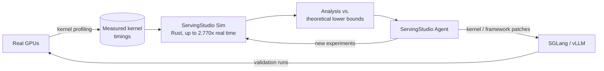

# ServingStudio

← [Simulation Index](index.md)

**ServingStudio** (SyFI Lab, University of Washington, Sept 2026) is an
integrated workbench for **simulating, analyzing, and optimizing LLM serving
systems**. It sits in a different spot from the per-layer
[LLM analysis tools](llm_tools.md): instead of a roofline estimate for one
forward pass, it simulates an entire *serving system* — requests, scheduler
iterations, batching, parallelism, and kernel execution — from **measured GPU
kernel timings**, calibrated against real SGLang and vLLM runs. An LLM agent
on top drives the simulator, profiles real hardware, and lands fixes in the
serving framework.

> Authors: Kan Zhu, Michael Gu, Sheetal Sriram, Mathew Jacob, Keisuke Kamahori,
> Vic Li, Yi Pan, Dedong Xie, Stephanie Wang, Arvind Krishnamurthy, Baris Kasikci.

---

## Architecture

### ServingStudio Sim

- Written in **Rust**; runs **up to 2,770× faster than real time**.
- Performance prediction is driven by **profiled kernel timings** (compute,
  communication, synchronization) rather than a purely analytical cost model.
- Predictions are **calibrated and validated against SGLang and vLLM**. The
  launch post gives no aggregate error figure.
- **Full observability**: individual runs, requests, scheduler iterations, and
  kernel executions can all be inspected.

**Modeled features**

| Area | Coverage |
|------|----------|
| Models | GLM-5.2 series, Qwen3-235B (planned: GLM-5.3 Flash, DeepSeek V4.1 Flash, Kimi K3) |
| Model classes | Dense and [mixture-of-experts](../workloads/moe.md) |
| Precision | Multiple quantization formats (e.g. NVFP4) |
| Parallelism | Tensor parallelism (TP), expert parallelism (EP) — see [parallelism](../modeling/parallelism.md) |
| Serving techniques | Prefix caching, [speculative decoding](../modeling/speculative_decoding.md), multi-token prediction, prefill–decode disaggregation, attention–FFN disaggregation |
| Hardware in case studies | NVIDIA B200, H200 |

### ServingStudio Agent

An autonomous agent (it runs on Codex or Claude) with a **skill library** for:
kernel discovery, simulator development (adding new models), framework
alignment, experiment design, performance analysis, and optimization. It
targets the slowest manual step in older simulators: bringing up a new model
or framework feature by hand. Given a serving goal, it designs experiments
and returns analysis, tradeoffs, and supporting evidence.

---

## Methodology: profile → simulate → bound

The workflow combines three levels of the
[simulation spectrum](index.md#taxonomy):

1. **Profiling.** Kernel-level GPU measurements of timings, communication, and
   synchronization.
2. **Simulation.** Fast end-to-end prediction of serving performance, built
   from those measurements.
3. **Analytical lower bounds.** Simulated GPU time is compared with a
   theoretical floor computed from FLOPs and data movement (a
   [roofline](../modeling/roofline.md)-style bound). The gap is then
   attributed to kernel inefficiency, missing fusion, batching, load
   imbalance, communication, redundant work, or idle time.

Step 3 turns the simulator from a predictor into a **cost-attribution tool**:
it shows *where* the time above the bound goes, not only how long a
configuration takes.

---

## Case Studies

| # | Setup | Finding | Result |
|---|-------|---------|--------|
| 1 | SGLang, GLM-5.2 NVFP4, 4× B200, TP4; 240 req, 4,096 in / 8 out tokens, concurrency 24 (prefill-dominated) | MoE kernel configs were not autotuned for this shape | **+5.6%** input throughput |
| 2 | vLLM, GLM-5.2 NVFP4, 4× B200, TP4 + EP4; 100 req, speculative decoding with 5 draft tokens per verify | CUDA-graph replay gap: CPU overhead reached **18.5%** of end-to-end runtime | **+10.8%** output throughput vs. the 2,048-token baseline config |
| 3 | Mini-SGLang, Qwen3-235B, 4× H200, TP4 + EP4; 256 req at concurrency 32, prefill-heavy | Agent implemented the missing features in the minimal framework | **+25.6%** output throughput vs. vLLM |

Case 2 is a reminder that host-side overhead can dominate serving even on
the fastest GPUs: once CUDA-graph replay fails to cover a shape,
kernel-launch latency becomes a first-order cost. See
[GPU kernels](../workloads/gpu_kernels.md) and
[inference optimization](../workloads/inference/optimization.md).

---

## Intended Users

- **Students and practitioners** who want to explore model and parallelism
  effects without access to a multi-GPU cluster.
- **Researchers** comparing serving configurations and their trade-offs.
- **Serving engineers** automating profiling and cost attribution.
- **Hardware teams** using predictions to guide selection and design.
- **Model architects** estimating the serving cost of architectural choices
  while the design is still changing.

---

## Positioning vs. Other Tools

| Tool | Granularity | Inputs | Answers |
|------|-------------|--------|---------|
| [LLM-Viewer](llm_tools.md#llm-viewer) / [LLMRoofline](llm_tools.md#llmroofline) | Per-layer, one forward pass | Model config + HW peak numbers | Is this op compute- or BW-bound? |
| [Analytical models](analytical.md) | Per-step latency | Formulas ± regression | Rough TTFT/TPOT for a config |
| **ServingStudio** | Whole serving system: requests, scheduler iterations, kernels | Measured kernel timings + framework semantics | Throughput/latency of a full deployment config, and where the time goes |
| [ASTRA-sim](distributed.md#astra-sim) | Distributed training, collectives, network | Chakra traces + topology | Comm/parallelism at cluster scale |

It belongs to the same class as earlier profile-driven serving simulators such
as Vidur (Microsoft, MLSys 2024). What it adds is coverage of 2026-era serving
features (disaggregation, MTP, NVFP4 MoE), calibration against both SGLang and
vLLM, and an agent loop that turns simulator findings into framework patches.

---

## Roadmap

- More models: GLM-5.3 Flash, DeepSeek V4.1 Flash, Kimi K3.
- Distributed prefix caches, including offloading across GPU, host, and
  remote storage tiers.
- Remote hardware profiling.
- A public **kernel-performance database**.

---

## Getting It

- Blog: [Introducing ServingStudio](https://syfi.cs.washington.edu/blog/2026-09-24-introducing-servingstudio/) (2026-09-24)
- Code: [github.com/SyFI-ServingStudio/ServingStudio](https://github.com/SyFI-ServingStudio/ServingStudio). This is an umbrella repo; each component repo carries its own license.
- Site: [servingstudio.cs.washington.edu](https://servingstudio.cs.washington.edu/)
- Prerequisites (per README): Linux, Python 3 + `uv`, Rust stable, Node.js 22,
  `just`, a C/C++ toolchain (CMake, Ninja, protoc, mold), tmux, Docker, and a
  configured Codex or Claude connection for the agent.

---

## See Also

- [LLM-specific analysis tools](llm_tools.md) — the per-layer roofline counterparts
- [LLM inference analytical model](../modeling/llm_inference.md)
- [Inference routing](../modeling/inference_routing.md) — prefix-cache-aware routing, which interacts with the prefix caching modeled here
- [Inference optimization](../workloads/inference/optimization.md) — the serving techniques ServingStudio simulates
- [llm-d](../scheduling/llm_d.md) — production disaggregated serving stack
- [Characterization](../characterization/index.md) — measuring TTFT/TPOT/throughput on real systems
